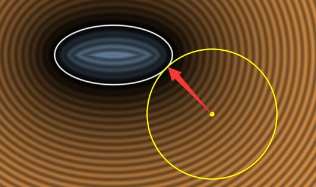

- [2D SDF](#2d-sdf)
  - [1. 概念](#1-概念)
  - [2. 基本图形](#2-基本图形)
  - [3. 变换](#3-变换)
  - [4. 集合](#4-集合)
  - [5. 图形（利用 集合运算）](#5-图形利用-集合运算)
  - [6. SDF 应用](#6-sdf-应用)
    - [6.1. 抗锯齿](#61-抗锯齿)
    - [6.2. 描边 / 轮廓](#62-描边--轮廓)
    - [6.3. 阴影 / 模糊](#63-阴影--模糊)
    - [6.4. 高光](#64-高光)
  - [7. 参考](#7-参考)
  - [8. 附录 fs（像素着色器）内置函数](#8-附录-fs像素着色器内置函数)
    - [8.1. 常规运算](#81-常规运算)
    - [8.2. 梯度](#82-梯度)

# 2D SDF

`Sign Distance Field`（有向）符号 距离 场

## 1. 概念

曲线 的 隐函数 表示 f(x, y) = 0；

例：半径为r的圆, f(x, y): x^2 + y^2 = r^2

**sdf(p, f) = 点 p 到 曲线 f(x, y) = 0 的 (最短）（带符号）距离**

如 曲线 封闭，那么：

+ sdf = 0, 边界
+ sdf < 0, 里
+ sdf > 0, 外

## 2. 基本图形

|图形|实现|
|--|--|
|圆，r|length(pt) - r|
|正方形，边长 a||
|半平面，射线 (p, u)|点乘 & 叉乘|

## 3. 变换

|名称|作用|实现|
|--|--|--|
|平移|指定 center|pt = pt - center|
|缩放|s|pt /= s|
|旋转|顺时针 正，rad|pt 绕 原点 旋转 -rad|
|变换矩阵|变换|pt = 逆矩阵 * pt|

## 4. 集合

|名称|作用|实现|
|--|--|--|
|补集 Complement|内部 <--> 外部|-A|
|并集 Union|A ∪ B|min(A, B)|
|交集 Intersection|A ∩ B|max(A, B)|
|差集 Difference|A - B = A ∩ ~B|max(A, -B)|
|平滑并集 Intersection|A ∩ B|[smin(A, B, k)](https://zhuanlan.zhihu.com/p/246501223)|
|平滑交集 Intersection|A ∩ B|smax(A, B, k) = -smin(-A, -B, k)|
|平滑差集 Difference|A - B = A ∩ ~B|smax(A, -B)|
|混合Mix|(A, B, t)|A*(1-t) + t*B|
|环 Annular|sdf, r|A - r|

## 5. 图形（利用 集合运算）

|图形|实现|
|--|--|
|矩形|4 个 半平面 的 交|
|三角形|3 个 半平面 的 交|
|扇形|圆 和 两个半平面 的 交|
|圆角矩形|（4个矩形 交 圆）并 大矩形|
|边框|大圆角矩形 - 小圆角矩形|

## 6. SDF 应用

+ 抗锯齿
+ 描边 / 轮廓
+ 阴影 / 模糊
+ 高光

### 6.1. 抗锯齿

### 6.2. 描边 / 轮廓

### 6.3. 阴影 / 模糊

### 6.4. 高光

## 7. 参考

+ [smooth min](https://zhuanlan.zhihu.com/p/246501223)
+ [ShaderToy基础教程-SDF运算](https://zhuanlan.zhihu.com/p/491686813)
+ [Facebook SDF](https://sparkar.facebook.com/ar-studio/learn/patch-editor/shader-patches/sdf-patches#example)

## 8. 附录 fs（像素着色器）内置函数

### 8.1. 常规运算

|函数|作用|实现|
|--|--|--|
|min(x, y)|最小|x < y ? x : y|
|max(x, y)|最大|x > y ? x : y|
|step(x, s)|阶梯，部分代替 if|x < s ? 1 : 0|
|clamp(x, a, b)|截断: 区间 [a, b]|x < a ? a : (x > b ? b : x)|
|mix(a, b, x)|线性插值; x 一般是 [0, 1], x=0返回a; x=1 返回 b|a(1 - x) + bx|
|smoothstep(a, b, x)|平滑插值; x < a 返回0; x > b 返回1; 否则平滑过渡|$t = clamp(\frac{x - a}{b - a}, 0, 1); 3t^2 - 2t^3$|

### 8.2. 梯度

注：片段着色器 2*2 一组，所以 相邻片段，对 同组 而言：

+ 左边 而言 是 左 - 右
+ 右边 而言 是 右 - 左

|函数|作用|实现|
|--|--|--|
|dFdx(v)|水平片段 对应 v 值 的 差|$f_{i+1, j}(v) - f_{i, j}(v)$||
|dFdy(v)|垂直片段 对应 v 值 的 差|$f_{i,j+1}(v) - f_{i,j}(v)$||
|fwidth(v)|v 微分|$abs(dFdx(v)) + abs(dFdy(v))$|